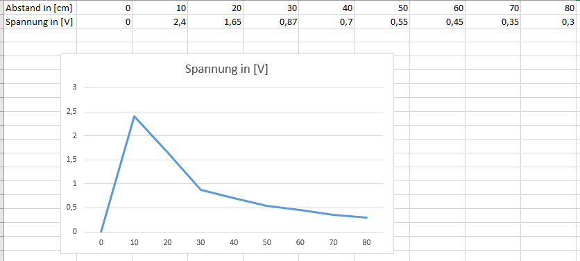

% Präsentation in Markdown
% Referent: David
% Date: \today


---
theme "AnnArbor"
header-includes:
colortheme: "seahorse"
fronttheme: "structurebold"
author: {width=5mm} David
---

# Erste Folie
Dashier wurde mit Markdown erstellt. Und von pandoc als PDF übersetzt

# Aufzählung mit Formatierung
- Punkt 1 mit *kursivem Text*
- Punkt 2 mit **fettem Text**
- Punkt 3 mit ~~durchgestrichenem Text~~

# Formeln und Quoting
>**Merke:**
>naja

$$\int_a^\infty\frac{x^2-a}{e^{x-b}} dx $$
$$f(x)=\sqrt{2-x}$$
$$U_{eff} = \frac{U^2}{\sqrt{2}}$$

# Bilder einbinden

````

````